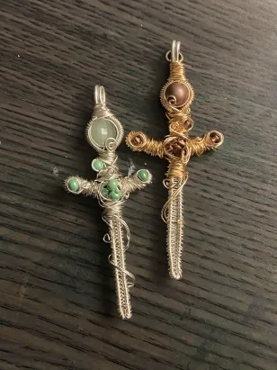
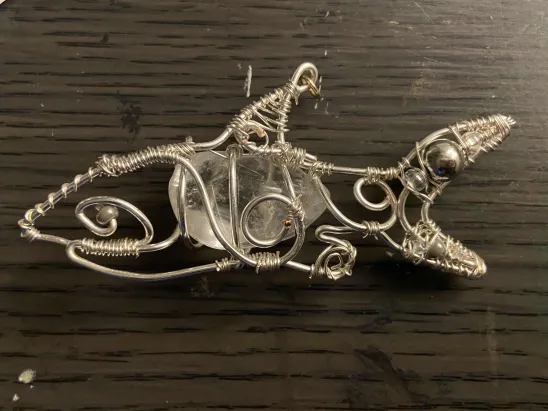
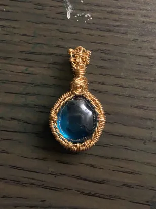

## Main 

Welcome to my blog! My name is Namira (she/her). Some things about me:

## Family & Culture
My parents are Bangladeshi immigrants, but I've lived in San Diego my whole life. 
I do a few dance performances for Bangladeshi festivals every year or so. You can find them on my [YouTube](https://www.youtube.com/@NamiraSharif).  
I have one (very annoying) younger brother, six cousins on my dad's side, two on my mom's. 6/8 of my cousins live back in Bangladesh.

## Hobbies/Interests
I like arts and crafts! I mostly make stuff out of wire or draw, but other forms of art are cool too. Cardboard and hot glue are my best friends.

Some of the wire crafts I've made:

    
    
    

